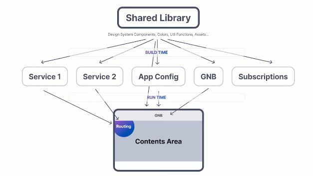

## What is Module Federation?

여러 개의 개별 빌드가 컨테이너처럼 작동하여 → 빌드 간에 코드를 노출하고 소비하여 → 런타임에 통합되어 하나의 애플리케이션처럼 동작하는 방식이다.

이를 이용하여 하나의 어플리케이션을 여러 개로 쪼개어 개발/빌드하고 런타임에 하나로 합쳐서 동작시킬 수 있다.

Webpack5에서 등장하였으며 webpack 설정만으로도 적용할 수 있다.

https://wire.lgcns.com/confluence/display/PS190414B1/Module+Federation

### 용어정리

- 로컬 모듈 (Local Module)
  - 단일 Webpack 빌드에 포함되는 모듈로, 단일 빌드 안에서만 로딩할 수 있다.
  - 서로 다른 Webpack 빌드의 결과물은 서로 다른 로컬 모듈이다.
- 원격 모듈 (Remote Module)
  - 현재 빌드의 일부가 아니며 원격 컨테이너에서 런타임에 로드되는 모듈이다.
  - 각 빌드는 개별 서버에 배포될 수 있고 런타임에 다른 원격 모듈을 로딩할 수 있다.
- 컨테이너 (Container)
  - 각각의 빌드이며 하나의 빌드가 하나의 웹 애플리케이션을 나타낸다.
  - 하나의 컨테이너는 다른 컨테이너의 원격 모듈을 로드할 수 있다.
- 공유 모듈 (Shared Module)
  - 여러 컨테이너에서 같이 사용되는 모듈이다.
- 리모트 앱 (Remote App)
  - 모듈을 다른 앱으로 내보내는 컨테이너이다.
- 호스트 앱 (Host App)
  - 원격 모듈을 사용하는 컨테이너이다.

### 사용법

1. **Webpack 설치**

웹팩 설정을 위해 필요한 패키지를 설치한다.
webpack v4 이상을 사용하기 위해서 cli도 설치해야 하므로 webpack-cli도 설치해야 한다.

```
npm install --save-dev webpack@5 webpack-cli
```

2. **Webpack 설정**

**Webpack 직접 설정 시**

Webpack 설정에서 plugins에 ModuleFederationPlugin을 추가함으로써 사용할 수 있다.

- name : 현재 컨테이너의 이름 (고유값)
- filename
  - expose한 원격 모듈을 호스트 앱에서 로딩할 수 있도록 인터페이스를 정의해야하는데, 이 파일의 이름을 의미한다.
  - 빌드 시 인터페이스가 정의된 파일이 생성된다.
  - default : remoteEntry.js
- exposes : 외부에 노출할 원격 모듈의 목록 → Remote app에서 설정
  - key
    - 모듈을 노출했을 때의 경로
    - 현재 컨테이너의 name을 기준으로 상대 경로로 입력
  - value
    - 해당 모듈의 코드 위치
    - 설정 파일을 기준으로 상대 경로로 입력
- remotes : 가져올 remote app의 목록 → Host app에서 설정
  - key : 가져올 remote app의 name
  - value : {remote app name}@{remote app의 public path}/{remote app의 filename}
- shared
  - 의존성을 갖는 모듈의 목록
  - 앱이 번들링 될 때 shared에 명시된 종속성을 모두 포함하여 번들링 되기 때문에 성능이 저하될 수 있다.
  - singleton = true (default : false)
    - 여러 컨테이너에서 사용할지라도 런타임에(사용하는 시점에) 한번만 로딩된다. (Lazy loading과 유사)
    - react, react-dom과 여러 개의 인스턴스를 생성해서 돌리면 안되는 것들은 singleton 옵션을 true로 해야한다.

https://wire.lgcns.com/confluence/pages/viewpage.action?pageId=752532468
https://wire.lgcns.com/confluence/pages/viewpage.action?pageId=827415662

### Remote App에서 내보내는 방법

```javascript
const ModuleFederationPlugin =
  require("webpack").container.ModuleFederationPlugin;

module.exports = {
  // ...
  output: {
    publicPath: "auto", // 청크 로드 에러 시 넣어주면 됨
  },
  plugins: [
    new ModuleFederationPlugin({
      name: "remote",
      filename: "remoteEntry.js", // Host app에서 접근할 수 있도록 하는 진입 경로
      remotes: {
        /**
         * key : host app에서 사용할 remote app의 이름
         * value : '{name}@{remote app의 url}/{filename}'
         *   - name/filename : remote app - webpack.config - ModuleFederationPlugin에서의 값
         */
      },
      exposes: {
        /**
         * key : host에서 사용할 모듈의 이름 (예 : "./App", "./Button" 등)
         * value : host로 내보낼 모듈의 경로 (예 : "./src/~~~")
         */
        "./Widget": "./src/Widget",
      },
      shared: { react: { singleton: true }, "react-dom": { singleton: true } },
    }),
  ],
};

// export {}; // ts 사용 시 TS1208 에러 방지 // BUT Remote App에서는 export 하면 안됨.
```

### Host App에서 불러온 Remote App을 사용하는 방법

```
const ModuleFederationPlugin = require('webpack').container.ModuleFederationPlugin;

module.exports = {
  // ...
  plugins: [
    new ModuleFederationPlugin({
      name: 'host',
      remotes: {
         // key : host app에서 사용할 remote app의 이름
         // value : '{remote app name (webpack config 기준)}@{remote app의 url}/{remote app의 file name (webpack config 기준)}'
         remote: `remote@http://localhost:3001/remoteEntry.js`,
      },
      exposes: {},
      shared: { react: { singleton: true }, "react-dom": { singleton: true } },
    }),
  ]
}

// export {}; // ts 사용 시 TS1208 에러 방지 // BUT Remote App에서는 export 하면 안됨.
```
