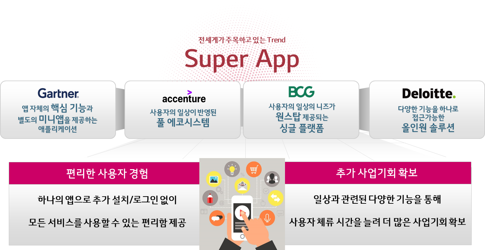
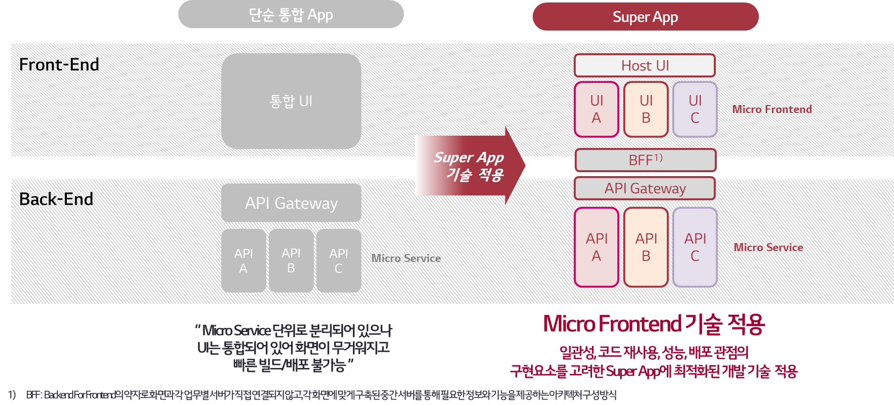

### Super App 이란?

### Super App 구축의 Pain Point

- 거대한 통합 Frontend
  - 거대한 Frontend로 인해 규모가 커질수록 성능 및 사용성 저하
  - 작은 기능 하나 수정해도 전체를 빌드해서 배포해야 해서 Lead Time 증가
  - 오류 혹은 장애 발생 시 전체 서비스 사용 불가
- Frontend와 Backend간 아키텍처 불일치
  - Backend는 Micro Service이지만, Frontend는 Monolithic으로 Service 하나만 수정해도 Frontend는 전체 빌드하여 배포가 필요
  - 서비스 간 API가 나뉘어 있어서 하나의 페이지에서 여러 API 호출하여 처리 필요
- 업무보다 복잡한 Frontend
  - 하나의 페이지를 담당 업무별로 여러 개발자가 개발 → 복잡도 증가
  - Frontend를 고려하지 않은 Backend 설계로 성능 및 데이터 보안에 대한 위협 증가
  - Frontend에 업무 로직 구현 필요

**Pain Point를 해결하려면 Frontend를 Backend처럼 Micro Service 단위로 쪼개서 각 담당자가 담당 조직에 맞는 모듈을 따로 개발/빌드/배포할 수 있는 기술이 필요하다**

### 관련 자료 링크

- https://wire.lgcns.com/confluence/pages/viewpage.action?pageId=826676590
- https://wire.lgcns.com/confluence/pages/viewpage.action?pageId=827415576
